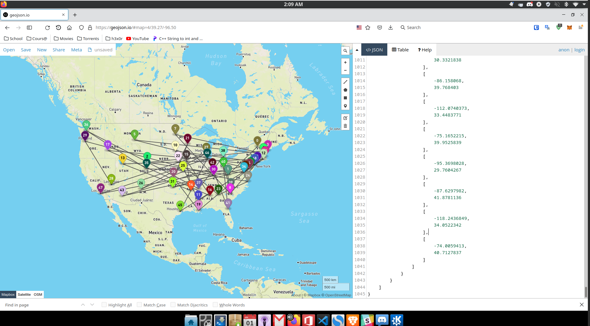

# Data Muniplication - Fowzy Alsaud
> This is a quick demo of some the Python things.
> Provided by Dr. Griffin, MSU Texas
---
## Requirments 
- Load json file
- Filter Alaska and Hawai out
- Sort by the closest city
- Give a rank by population
- Make point by the json file
  - each point has different color
  - needs to be in geo json formating
- Make lines string
- Combine two of these data into geo json file
- Filter by population
- Out put to geojson.io for testing
- More details in here: [Requirments](Requirments.md)

- Screenshot

## Other Python Project:

- [Twin Evil Attack Detector](https://github.com/fowzy/Panopticon)
  - or this [link](https://github.com/fowzy/CMPS-4143/tree/master/Projects/Files/Panopticon)
  
- [Object Oriented Programming Concepts in one of my project Game (SMGL)](https://github.com/fowzy/2143-OOP-ALSAUD/tree/main/Assignments/P01)

- [Object Oriented Programming Concepts in one of my project GrapViz](https://github.com/fowzy/2143-OOP-ALSAUD/tree/main/Assignments/P02)

## Sources:
  - [IBM GeoJSON format](https://www.ibm.com/docs/en/db2/11.5?topic=formats-geojson-format)
  - [Geojson.io](https://geojson.io)